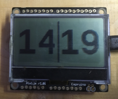

# Cog Display
Display smart bike trainer gear on pixl.js.



Inspired by the [Cog Display](https://apps.garmin.com/en-US/apps/44389c39-dae2-4eb8-bcee-1bb16d977159) Connect IQ app created by Clement Barthes for Garmin cycling computers.  The app calculates which gear cog you are using based on speed and cadence and displays it on your Garmin device.  The left number is the cog if your are in the small ring, the right number is the cog if you are in the big ring.

This project does the same thing with indoor smart bike trainers and displays the results on an Arduino Pixl.js.

Currently this has only been tested on a Wahoo Kickr Core.  However it should work with any smart bike trainer that supports the FTMS Bluetooth Protocol.

## Requirements
- An indoor bike trainer that supports the FTMS Bluetooth Protocol.
- An Arduino [Pixl.js](http://www.espruino.com/Pixl.js).

## Installation

### Prepare Pixl.js
Follow the Pixl.js [Getting Started Guide](http://www.espruino.com/Quick+Start+BLE#pixljs) to learn how to connect to and flash scripts to the Pixl.js.

### Set Bluetooth Address
Update the ble_address const at the start of the CogDisplay.js script to the Bluetooth address of your smart trainer.
```
const ble_address = "c5:a7:9d:69:f5:66 random";
```
To find the bluetooth address you can use a smart phone app such as nRF Connect. Alternatively this project also includes a SearchDevices.js script.  If you run this script on the Pixl.js it will list all the Bluetooth devices it finds to the debug console.

### Set Bike Parameters
Set the following constants to match your bike.
```
const chainrings = [39,53];
const cogs = [11,12,13,14,15,17,19,22,25,28];
const wheelCircumference = 2.096;
```
For Wahoo bike trainers you can set the wheel circumference in the Wahoo app.  The value you set in the const should match what you set in the app.

### Ride
Flash the CogDisplay.js script to your Pixl.js.  The Pixl.js should connect to your bike trainer.  Open your training software such as Zwift and start riding.  Your current cog selection should be displayed on your Pixl.js.